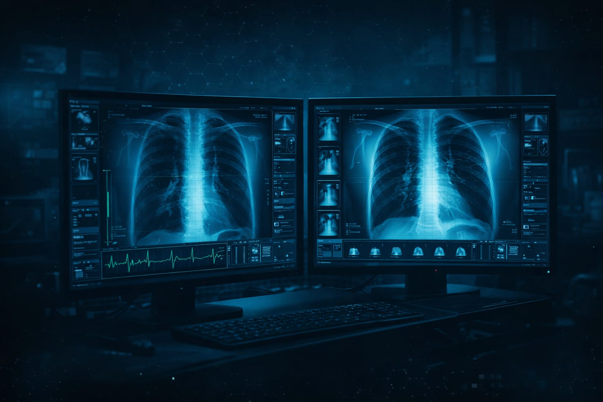

# 🫁 PneumoniaLens AI: Advanced Clinical Second-Opinion System

 ## 🎯 Overview
**PneumoniaLens AI** is an enterprise-grade, web-based diagnostic tool designed to assist radiologists and emergency department personnel. By leveraging a fine-tuned DenseNet121 Deep Learning architecture, it acts as a rapid-triage "second opinion" to differentiate between Normal lungs, Bacterial Pneumonia, and Viral Pneumonia in chest X-rays.

Our mission is to bridge the diagnostic gap, reduce "diagnostic fatigue" in high-stress clinical environments, and provide transparent, explainable AI (XAI) insights.

---

## ✨ Key Enterprise Features

* **🧠 Deep Learning Triage (DenseNet121):** * Analyzes 60 layers of a fine-tuned architecture in seconds.
  * Achieves a clinically honest **81.28% true accuracy** on the complex 3-class differential diagnosis (addressing the extreme visual overlap between viral and bacterial presentations).
  * Hosted securely via Hugging Face to bypass GitHub's LFS limits and maintain a 0.0% idle CPU load using `@st.cache_resource`.

* **🔍 Explainable AI (XAI) via Grad-CAM:** * Generates real-time "Heatmaps of Interest" overlaid on the patient's X-ray.
  * Ensures doctors can visually verify the specific thoracic regions driving the AI's classification, building trust and reducing false positives.

* **🛡️ Medical-Grade Security & Authentication:**
  * **Role-Based Access Control (RBAC):** Strict separation between System Administrators and Licensed Doctors.
  * **Persistent Token Sessions:** Custom URL-injected Base64 tokens keep doctors logged in through browser refreshes without exposing their raw ID.
  * **Automated Inactivity Lock:** A built-in "heartbeat" timer automatically revokes access and wipes session state after 15 minutes of idle time to ensure compliance in shared clinical workspaces.

* **☁️ Cloud Database & Audit Logging:**
  * Integrates seamlessly with Google Sheets via a custom Google Apps Script API.
  * Automatically handles secure credential generation, access revocation, and comprehensive chronological logging of all diagnostic scans.

* **📄 Automated Clinical PDF Reporting:**
  * Uses `reportlab` to dynamically generate downloadable, medical-grade PDF reports.
  * Injects the original X-ray, the Grad-CAM heatmap, automated clinical findings, and strict medical disclaimers directly into a printable format.

* **🎨 Custom "Dark Glass" UI/UX:**
  * Fully custom CSS and JavaScript auto-clickers override standard Streamlit behaviors to create a sleek, immersive, dark-mode software experience.

---

## 🛠️ Technology Stack
* **Frontend/Framework:** Python, Streamlit, HTML/CSS/JS (Components)
* **AI & Computer Vision:** TensorFlow, Keras, OpenCV, NumPy, Pillow
* **Cloud & Database:** Google Sheets API, Google Apps Script, Hugging Face
* **Document Generation:** ReportLab, python-docx

---

## 🚀 Local Installation & Setup

1. **Clone the repository:**
   ```bash
   git clone [https://github.com/Ronit-0/PneumoniaLens-AI.git](https://github.com/Ronit-0/PneumoniaLens-AI.git)
   cd PneumoniaLens-AI

## Install dependencies:

   ```bash
   pip install -r requirements.txt
```
## Set up Secrets (crucial for database & admin access):

Create a .streamlit folder in the root directory.

Inside it, create a secrets.toml file with your Google Sheets API keys and Admin credentials:
```bash
Ini, TOML
[admin]
id = "your_admin_id"
password = "your_admin_password"

[connections.gsheets]
spreadsheet = "your_google_sheet_url"
```
## Run the Application:

```bash
streamlit run App.py
```
(Note: The app will automatically download the 85MB .h5 model weights from Hugging Face on the first run).

## ⚠️ Clinical Disclaimer
This software (PneumoniaLens v2.0) is strictly an assistive "second-opinion" tool and MUST NOT be used as a standalone diagnostic device. It is subject to errors and cannot account for full patient history or bloodwork. Always consult a specialized radiologist or attending physician for definitive diagnoses.
